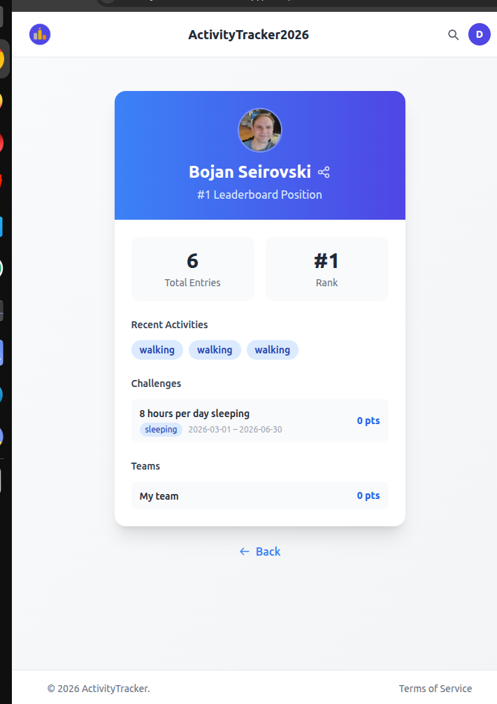
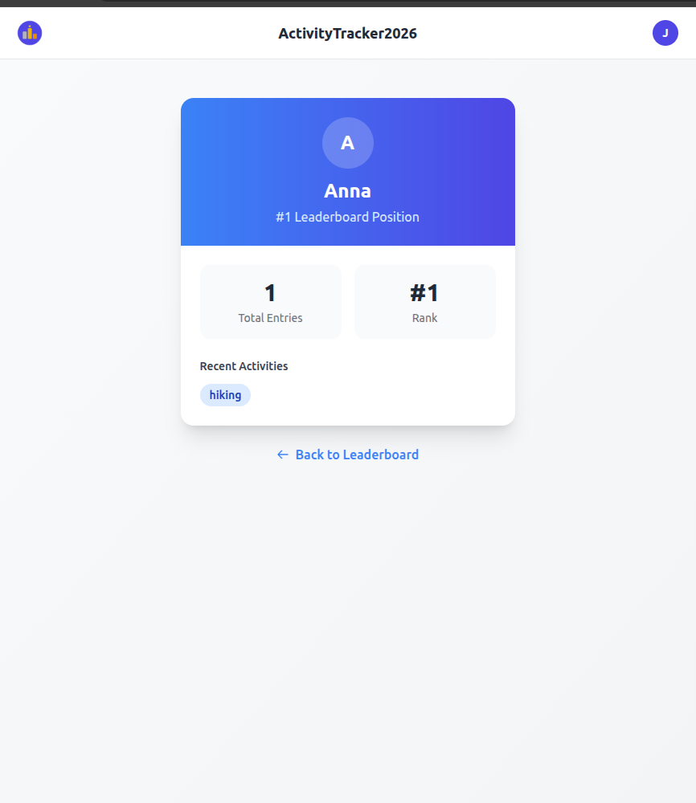
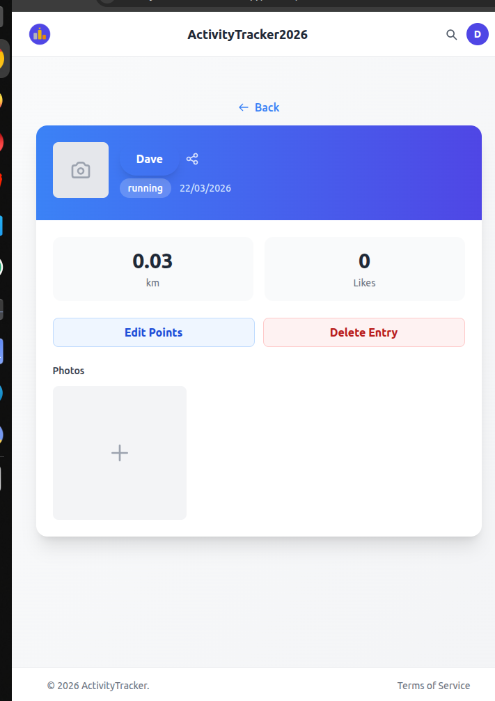
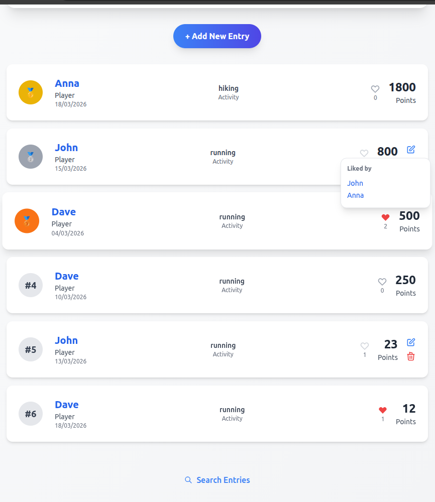

# ActivityTracker2026

A competitive activity tracking and leaderboard app. Users log activities with points, compete on a ranked leaderboard, like each other's entries, and manage custom activity categories.

---

## Screenshots

| | |
|---|---|
|  |  |
|  |  |

---

## Features

- **Leaderboard** — Ranked entries by points with infinite scroll and top-3 podium
- **Activity Entries** — Log activities with name, type, points, and date
- **Custom Activity Types** — Create and manage your own activity categories
- **User Profiles** — View personal stats, rank, and activity history
- **Social Likes** — Like entries and see who liked them
- **Search** — Search entries by name in real time
- **Challenges** — Time-bound competitions with their own leaderboard; join and track points per challenge
- **Teams** — Permanent groups with a shared leaderboard; join and accumulate points together
- **Public User Profiles** — View any user's stats, rank, recent activities, challenges, and teams without logging in
- **Image Uploads** — Upload images for teams, challenges, and profiles (stored in AWS S3)
- **Unit Preferences** — Users can choose km or mi; distances display in their preferred unit
- **Stats & Charts** — Distance averages (week/month/year) for users and teams; total distance and top-20 leaderboards for challenges and teams
- **GPS Tracking** — Record routes via mobile; view mini map on each leaderboard card
- **Entry Gallery** — Upload and view multiple photos per activity entry
- **Web App** — Standalone React SPA with leaderboard, entries, challenges, teams, profiles, and search
- **Authentication** — Register, login, logout with JWT-based auth
- **Forgot Password** — Secure email-based password reset via MailerSend (24-hour token)

---

## Tech Stack

### Web App
| | |
|---|---|
| Framework | React (Create React App) |
| Routing | React Router |
| Styling | Tailwind CSS |
| Icons | Ionic Icons v7 |
| Maps | Leaflet + react-leaflet |
| Language | TypeScript 4.9 |

### Mobile App
| | |
|---|---|
| Framework | Expo SDK 55 + React Native 0.83.2 |
| Routing | Expo Router (file-based) |
| Styling | NativeWind v4 (Tailwind for RN) |
| Language | TypeScript 5.9 |
| Targets | iOS · Android · Web |

### Backend
| | |
|---|---|
| Runtime | Node.js 20 |
| Framework | Express 5 + TypeScript 5.9 |
| Database | PostgreSQL 15 (Drizzle ORM) |
| Auth | JWT (jsonwebtoken) + bcrypt |
| Email | MailerSend |
| Image Storage | AWS S3 (Multer for uploads) |

---

## Getting Started

All repos must be cloned as siblings inside the same parent directory:

```
dev/
├── masiboard-web/       ← web app (React + Tailwind CSS)
├── masiboard/   ← mobile/web app (Expo + React Native)
├── masiboard-be/    ← backend (Express + PostgreSQL)
└── README.md
```

### Development

Run each service from its own directory (they have separate compose files):

```bash
# Backend (API + PostgreSQL) — from masiboard-be/
docker compose -f docker-compose.dev.yml up --build

# Web app (React) — from masiboard-web/
docker compose -f docker-compose.dev.yml up --build
# or natively:
npm start

# Mobile app (Expo) — from masiboard/
docker compose -f docker-compose.dev.yml up --build
# or run natively (also enables iOS/Android via Expo Go):
npx expo start
```

- Web app: http://localhost:3001
- Expo web: http://localhost:8081 · Expo mobile: scan QR code with Expo Go
- Backend API: http://localhost:3000

Hot-reloading is enabled for all services via Docker Compose watch.

### Production

```bash
# Web app
docker compose -f masiboard-web/docker-compose.yml up --build

# Mobile/Web app
docker compose -f masiboard/docker-compose.yml up --build
```

- Web app: http://localhost:3002 (nginx, proxies `/api/*` to the backend)
- Mobile/Web app: http://localhost:3003 (nginx, proxies `/api/*` to the backend)

---

## Environment Variables

### `masiboard-web/` (see `.env.example`)

| Variable | Default | Description |
|---|---|---|
| `REACT_APP_API_URL` | `http://localhost:3000` | Backend API base URL (build-time) |

### `masiboard/` (see `.env.example`)

| Variable | Default | Description |
|---|---|---|
| `EXPO_PUBLIC_API_URL` | `http://localhost:3000` | Backend API base URL |

### `masiboard-be/` (see `.env.example`)

| Variable | Default | Description |
|---|---|---|
| `POSTGRES_USER` | `masiboard` | PostgreSQL username |
| `POSTGRES_PASSWORD` | `masiboard` | PostgreSQL password |
| `POSTGRES_DB` | `masiboard` | PostgreSQL database name |
| `JWT_SECRET` | `changeme` | Secret for signing JWT tokens |
| `CORS_ORIGIN` | `http://localhost:3001` | Allowed CORS origin |
| `PORT` | `3000` | API server port |
| `MAILERSEND_API_KEY` | _(required for email)_ | MailerSend API key |
| `MAILERSEND_FROM_EMAIL` | `noreply@example.com` | Sender email address |
| `FRONTEND_URL` | `http://localhost:3001` | Used to build password reset links |
| `AWS_ACCESS_KEY_ID` | _(required for images)_ | AWS access key for S3 |
| `AWS_SECRET_ACCESS_KEY` | _(required for images)_ | AWS secret key for S3 |
| `AWS_REGION` | _(required for images)_ | AWS region for S3 bucket |
| `AWS_S3_BUCKET` | _(required for images)_ | S3 bucket name for image uploads |

Docker Compose reads these values automatically from the `.env` file next to the compose file being used.
